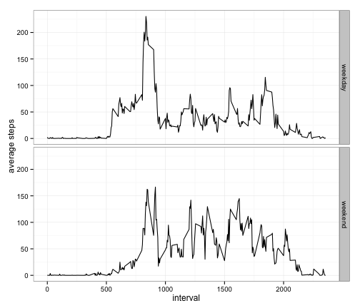

# Reproducible Research: Peer Assessment 1


## Loading and preprocessing the data

The initial preparation of the activity data:


```r
setwd("~/Projects/RepData_PeerAssessment1")
activity <- read.csv("activity.csv")
activity$date <- as.Date(activity$date, format = "%Y-%m-%d")
```


## What is mean total number of steps taken per day?

Let's get a sense of the distribution of steps per day by building a histogram:

```r
library(reshape2)
steps_per_day <- dcast(activity, date ~ ., fun.aggregate = sum, na.rm = TRUE, value.var = "steps")
hist(steps_per_day$., breaks = 10, xlab = "", main = "Steps per day")
```

 

The mean and median steps per day:

```r
mean_steps <- round(mean(steps_per_day$.), 0)
median_steps <- median(steps_per_day$.)
paste("Mean: ", mean_steps, ", Median: ", median_steps, sep="")
```

```
## [1] "Mean: 9354, Median: 10395"
```

## What is the average daily activity pattern?

Let's look at the 5-minute intervals averaged across all the days:

```r
intervals <- dcast(activity, interval ~ ., fun.aggregate = mean, na.rm = TRUE, value.var = "steps")
with(intervals, plot(interval, ., type = "l", lwd = 2, ylab = "average number of steps"))
```

 

We can see a peak in the average steps for a given interval somewhere between 700 and 1000. To find the interval with the maximum number of steps:

```r
intervals$interval[which.max(intervals$.)]
```

```
## [1] 835
```

## Imputing missing values

Let's find out how many missing values there are in the dataset:

```r
sum(is.na(activity$steps))
```

```
## [1] 2304
```

This corresponds to a percentage of the total step measurements:

```r
round(100 * sum(is.na(activity$steps))/length(activity$steps))
```

```
## [1] 13
```

One way to deal with these missing values is to substitute in the mean value for that interval. Let's duplicate `activity` into a data frame `activity_filled`:

```r
activity_filled <- activity
for (i in 1:nrow(activity_filled)) { 
  if(is.na(activity_filled[i,"steps"])) {
    interval <- activity_filled[i,"interval"]
    fill_value <- intervals[intervals$interval == interval, "."]
    activity_filled[i,"steps"] <- fill_value 
  }
}
```

With the missing values filled in, let's look at a histogram:

```r
steps_per_day_filled <- dcast(activity_filled, date ~ ., fun.aggregate = sum, na.rm = TRUE, value.var = "steps")
hist(steps_per_day_filled$., breaks = 10, xlab = "", main = "Steps per day")
```

 

The mean and median steps per day:

```r
mean_steps_filled <- round(mean(steps_per_day_filled$.), 0)
median_steps_filled <- round(median(steps_per_day_filled$.))
paste("Mean: ", mean_steps, ", Median: ", median_steps, sep="")
```

```
## [1] "Mean: 9354, Median: 10395"
```

Filling in the missing values with the average for the appropriate interval will of course increase the mean and median values we compute. These values are different from the originals we computed earlier by 13% and 3%, respectively. 

## Are there differences in activity patterns between weekdays and weekends?

Identifying dates as "weekday" or "weekend" can be extracted out into a function:

```r
weekend <- function(dates) { 
  dayofweek <- weekdays(dates) 
  ifelse(dayofweek == "Saturday" | dayofweek == "Sunday", "weekend", "weekday")
}
```

Then we can add a variable to our `activity_filled` data frame and compute the average steps over interval and weekend values:

```r
activity_filled$weekend <- factor(weekend(activity_filled$date))
interval_weekend <- dcast(activity_filled, interval + weekend  ~ ., fun.aggregate = mean, na.rm = TRUE, value.var = "steps")
```

To create the plot, we can use ggplot with the facet_grid:

```r
library(ggplot2)
g <- ggplot(interval_weekend, aes(interval, .))
g + geom_line() + facet_grid(weekend ~ .) + theme_bw() + ylab("average steps")
```

 

